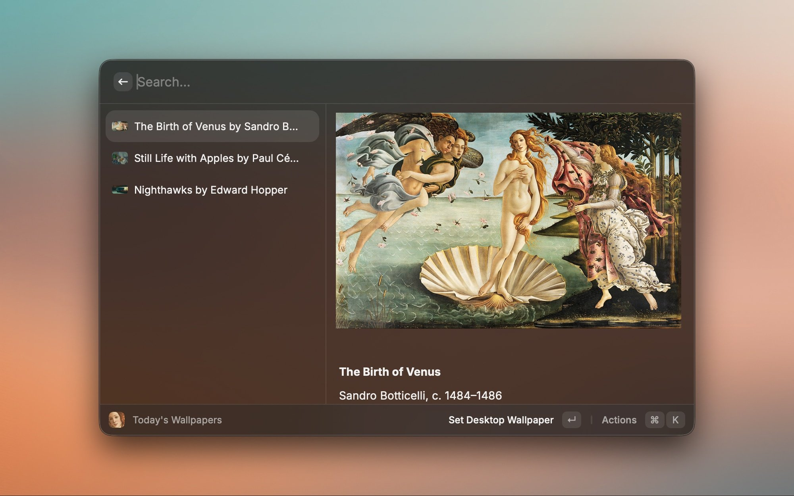
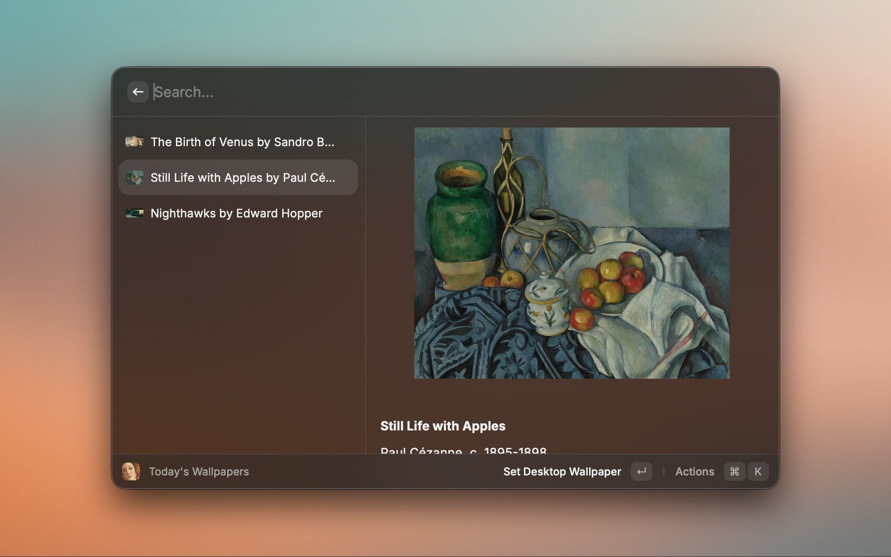
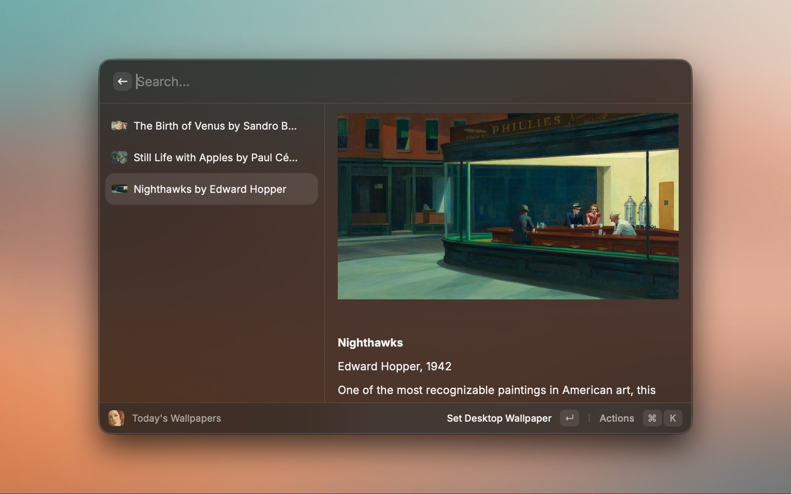

# Basalt Wallpaper

A Raycast extension for [Basalt](https://basalt.yevgenglukhov.com) — a daily wallpaper service with hand-picked fine art.

## What It Does

Browse and set Basalt wallpapers without leaving Raycast. The collection is classic paintings and artworks, all chosen by hand — no algorithmic slop.

## Commands

**View Today's Wallpapers**

Shows the three most recent wallpapers. Preview them, see the details (title, artist, year), set one as your background, or download it.

**Set Random Wallpaper**

Instantly sets a random wallpaper from the Basalt collection. No UI, no prompts — just a fresh background.

## Requirements

None. The extension talks directly to Basalt — no Mac app needed.

## Screenshots

