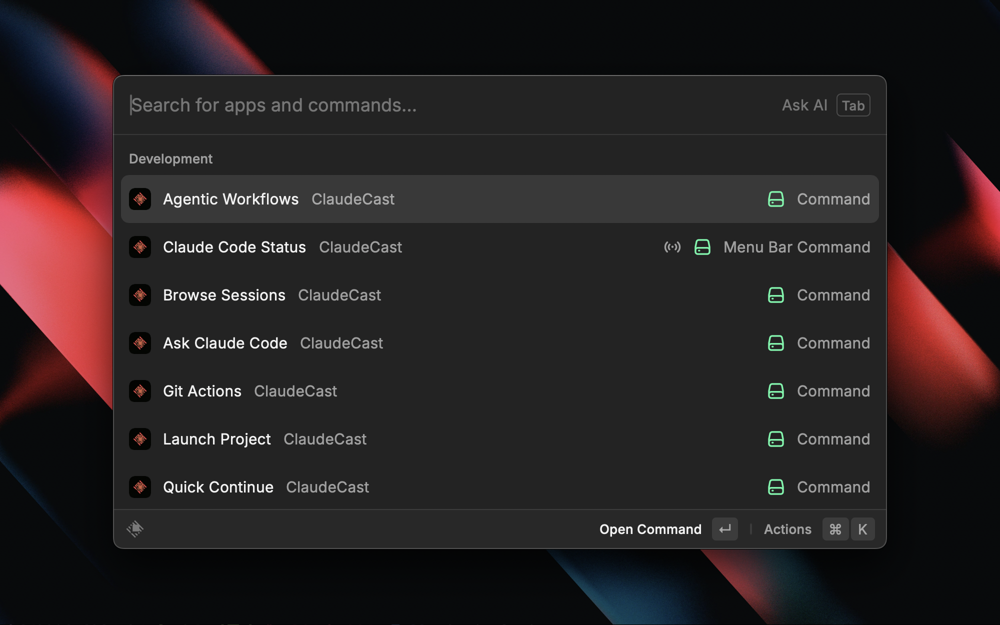
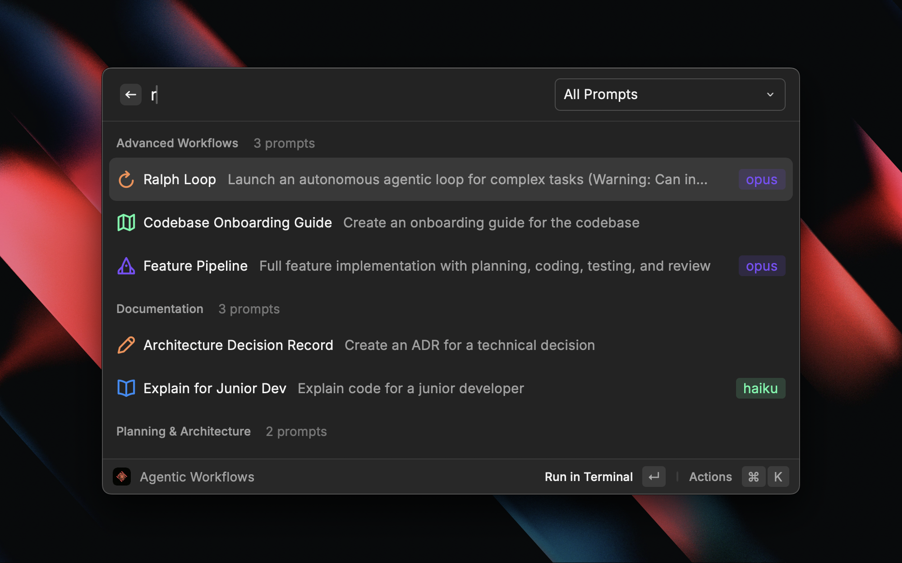

<p align="center">
  
</p>

<h1 align="center">ClaudeCast</h1>

<p align="center">
  <strong>Claude Code workflows at your fingertips</strong><br>
  A comprehensive Raycast extension that bridges Claude Code's powerful agentic CLI with Raycast's instant-access UI.
</p>



---

## Features

### Launch Project
Fast project switching for Claude Code. Browse all your projects with favorites, recents, and session counts.

- Discovers projects from Claude Code history
- Integrates with VS Code recent workspaces
- Launch new session or continue existing
- Open in VS Code or Finder
- Manage favorites

### Browse Sessions
Find and resume any Claude Code conversation across all projects.

- Search sessions by content
- Filter by project
- View conversation preview
- Resume, fork, or delete sessions
- See cost and token usage per session

### Agentic Workflows
Curated collection of production-tested prompts with variable substitution.


**Categories:**
- Planning & Architecture
- Test-Driven Development
- Code Review & Security
- Refactoring
- Debugging
- Documentation
- Advanced Multi-Step Workflows


### Ralph Loop
Autonomous agentic execution that breaks down complex tasks and runs them with fresh context per iteration.



**How it works:**
1. Describe your task and requirements
2. Claude creates a plan with atomic, self-contained tasks
3. Each task runs in a fresh Claude session (~176K tokens available)
4. Watch Claude work with full TUI visibility
5. Resume anytime if max iterations reached

**Features:**
- Fresh context per task prevents degradation at high token counts
- Full terminal UI visibility during execution
- Graceful stop with `touch .ralph/stop`
- Resume with `bash .ralph/resume.sh 10`

### Git Actions
Git-aware Claude Code workflows for common tasks.


- Review staged changes
- Generate commit messages
- Explain recent diffs
- Review unstaged changes
- Summarize branch changes


### Ask Claude Code
Quick prompt with automatic context capture from VS Code. Select text anywhere, hit the hotkey, and get answers without opening a terminal.

- Auto-detects current project from VS Code
- Captures selected text and clipboard
- Shows git branch context
- Supports all Claude models (Sonnet, Opus, Haiku)
- Continue conversation in terminal

### Transform Selection
One-keystroke code transformations from any app.


- Explain code
- Explain regex
- Find bugs
- Convert to another language
- Add TypeScript types
- Optimize performance
- Add comments
- Write tests


### Quick Continue
One keystroke to continue your last Claude Code session. No UI - just launches directly.

### Menu Bar Monitor
Real-time Claude Code status in your menu bar.

- Active session indicator
- Today's cost and session count
- Quick access to all commands

### Usage Dashboard
Detailed cost and usage metrics.

- Daily/weekly/monthly trends
- Cost breakdown by project
- Top expensive sessions
- ASCII cost charts

## Installation

### Prerequisites

1. **Claude Code CLI**: Install the Claude Code CLI tool
   ```bash
   npm install -g @anthropic-ai/claude-code
   ```

2. **Raycast**: Download from [raycast.com](https://raycast.com)

### Install Extension

1. Clone this repository or download the extension
2. Open Raycast and search for "Import Extension"
3. Select the `claude-cast` directory
4. Or run in development mode:
   ```bash
   cd claude-cast
   npm install
   npm run dev
   ```

## Setup

### OAuth Token (Required for API Features)

Some features (Ask Claude Code, Transform Selection, Git Actions) require an OAuth token to work in Raycast's sandboxed environment:

1. Generate a long-lived OAuth token:
   ```bash
   claude setup-token
   ```

2. Copy the token and add it to ClaudeCast preferences:
   - Open Raycast → Search "ClaudeCast" → Press `⌘,`
   - Paste the token in the "OAuth Token" field

### Configuration

Open Raycast preferences and configure ClaudeCast:

- **Default Model**: Choose between Sonnet (balanced), Opus (most capable), or Haiku (fastest)
- **Terminal Application**: Select your preferred terminal (Terminal, iTerm, Warp, Kitty, Ghostty)
- **Claude Code Path**: Optionally specify a custom path to the Claude CLI binary
- **OAuth Token**: Long-lived token from `claude setup-token` (required for API features)

## Usage

### Keyboard Shortcuts (Suggested)

Set these in Raycast preferences:

| Command | Suggested Shortcut |
|---------|-------------------|
| Ask Claude Code | `⌘⇧C` |
| Quick Continue | `⌘⌥R` |
| Browse Sessions | `⌘⌥S` |
| Launch Project | `⌘⌥L` |
| Git Actions | `⌘⇧G` |
| Agentic Workflows | `⌘⌥P` |
| Transform Selection | `⌘⇧T` |

### Tips

1. **Context Capture**: For best results, select code in VS Code before triggering Ask Claude Code
2. **Project Detection**: Keep VS Code open in your project for automatic project detection
3. **Quick Continue**: Use this when you step away and want to resume your last conversation
4. **Agentic Workflows**: Start with built-in prompts, then create custom ones for your workflows
5. **Git Actions**: Stage your changes first, then use "Write Commit Message" for AI-generated commits

## Development

```bash
# Install dependencies
npm install

# Start development
npm run dev

# Build for production
npm run build

# Lint code
npm run lint

# Fix lint issues
npm run fix-lint
```

## Project Structure

```
claude-cast/
├── src/
│   ├── ask-claude.tsx          # Quick Prompt command
│   ├── browse-sessions.tsx     # Session Browser
│   ├── launch-project.tsx      # Project Launcher
│   ├── quick-continue.tsx      # Quick Continue
│   ├── git-actions.tsx         # Git Actions
│   ├── prompt-library.tsx      # Agentic Workflows
│   ├── transform-selection.tsx # Transform Selection
│   ├── menu-bar-monitor.tsx    # Menu Bar Monitor
│   ├── usage-dashboard.tsx     # Usage Dashboard
│   └── lib/
│       ├── claude-cli.ts       # Claude CLI integration
│       ├── session-parser.ts   # JSONL session parsing
│       ├── project-discovery.ts # Project detection
│       ├── context-capture.ts  # VS Code context capture
│       ├── terminal.ts         # Terminal launch utilities
│       ├── prompts.ts          # Built-in prompts
│       └── usage-stats.ts      # Usage statistics
├── assets/
│   └── command-icon.png        # Extension icon
├── package.json
├── tsconfig.json
└── README.md
```

## License

MIT

## Contributing

Contributions welcome! Please read the contributing guidelines first.

## Credits

Built with [Raycast](https://raycast.com) and [Claude Code](https://anthropic.com/claude-code).
