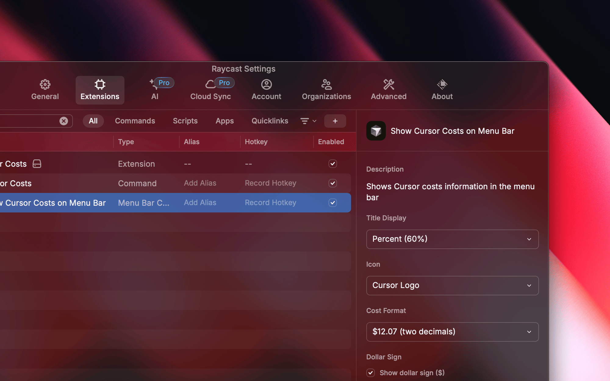
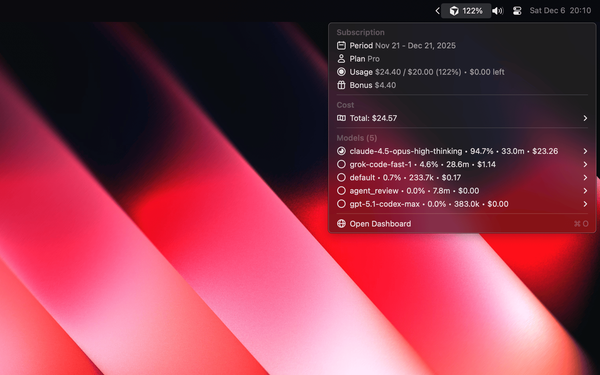
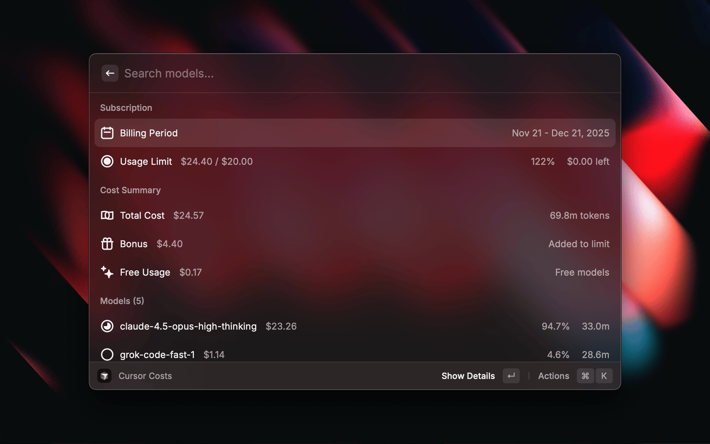
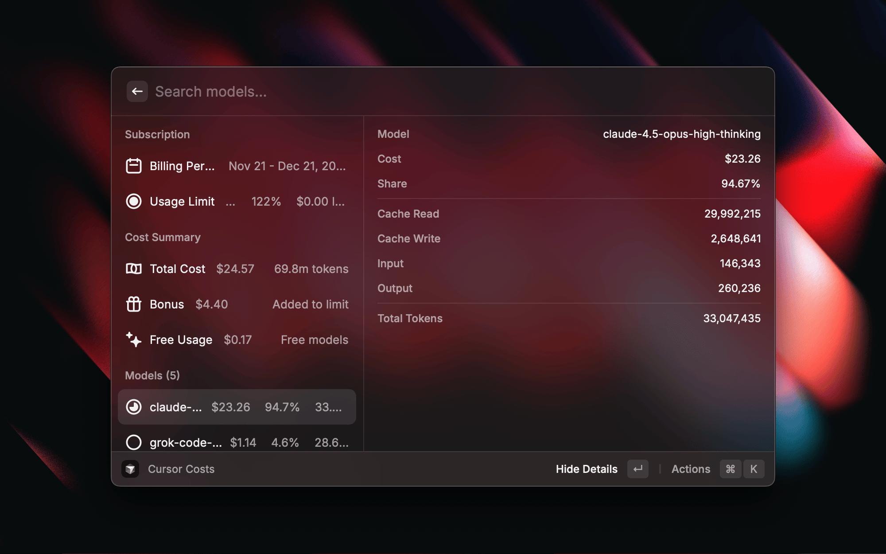

<p align="center">
  
</p>

<h1 align="center">Cursor Costs</h1>

<h3 align="center">
Track your Cursor costs in real-time directly from macOS menu bar
</h3>

---

<div align="center">

[](https://deepwiki.com/shadeov/cursor-costs-raycast)

</div>

Track your Cursor costs in real-time directly from macOS menu bar with this Raycast extension.

## Features

- **Menu Bar Display** — Shows usage percentage, cost, or both with customizable icon
- **Detailed Breakdown** — View all AI models with individual costs and percentages
- **Token Statistics** — Input/output tokens, cache read/write operations
- **Subscription Info** — Billing period, plan type, usage limits
- **Auto Refresh** — Configurable interval from 1 minute to 30 minutes
- **Customizable Display** — Choose what sections and information to show
- **Quick Actions** — Refresh, open dashboard, copy values with keyboard shortcuts

## Installation

Install from [Raycast Store](https://www.raycast.com/shadeov/cursor-costs) or search "Cursor Costs" in Raycast.

## Setup

### Get Your Session Token

1. Open [cursor.com](https://cursor.com) in your browser
2. Sign in to your account
3. Open Developer Tools (`F12` or `Cmd+Option+I`)
4. Go to **Application** tab → **Cookies** → **cursor.com**
5. Find cookie named `WorkosCursorSessionToken`
6. Copy the **entire value** (including `%3A%3A` characters)

### Configure Extension

1. Open Raycast and find "Cursor Costs"
2. Press `Opt+Cmd+,` or go to extension preferences
3. Paste the token into **WorkOS Session Token** field

### Global Settings

| Setting | Description | Default |
|---------|-------------|---------|
| WorkOS Session Token | Authentication token from Cursor cookies | Required |
| Refresh Interval | Data update frequency (1min – 30min) | 1 minute |
| Date Range | Statistics period: Billing Cycle or Calendar Month | Billing Cycle |

### Menu Bar Settings

| Setting | Description | Default |
|---------|-------------|---------|
| Title Display | What to show: Percent, Cost, Usage, or Cost + Percent | Percent |
| Icon | Cursor Logo or Progress Circle | Cursor Logo |
| Cost Format | Decimal places (0, 1, or 2) | 2 decimals |
| Show Dollar Sign | Display `$` prefix in title | Enabled |

#### Menu bar preferences example:



### Section Visibility

| Setting | Description | Default |
|---------|-------------|---------|
| Subscription Section | Show billing period and plan info | Enabled |
| Cost Section | Show total cost summary with tokens | Enabled |
| Models Section | Show models breakdown | Enabled |
| Tokens Section | Show separate tokens breakdown | Disabled |

### Model Display Settings

| Setting | Description | Default |
|---------|-------------|---------|
| Model Info | Show Cost + Tokens, Only Cost, Only Tokens, or None | Cost + Tokens |
| Show Percent | Display percentage in model info | Enabled |
| Token Format | Short (15.8m) or Full (15,800,000) | Short |

### Quick Actions

| Setting | Description | Default |
|---------|-------------|---------|
| Refresh Button | Show refresh button in menu | Disabled |
| Settings Button | Show settings button in menu | Disabled |

## Usage

### Menu Bar

After setup, a Cursor icon appears in your menu bar showing usage information.

#### Expanded Menu Bar with Subscription, Cost, Models, and Tokens sections:




**Click to see:**

- Subscription info (billing period, plan, usage limit)
- Total cost with token breakdown
- Models breakdown with costs and percentages

**Keyboard Shortcuts:**

| Action | Shortcut |
|--------|----------|
| Refresh Data | `⌘R` |
| Open Cursor Dashboard | `⌘O` |
| Extension Preferences | `⌘⇧O` |

### List View

Open Raycast and run **Cursor Costs** command for detailed view.

#### Compact model list:



#### Model list with details expanded:



**Features:**

- Search models by name
- View per-model statistics (cost, percentage, tokens)
- Toggle detailed view with `⌘D`
- Copy model name (`⌘C`) or cost (`⌘⇧C`)

## Troubleshooting

### Token Expired or Invalid

1. Re-login to [cursor.com](https://cursor.com)
2. Copy the token again from cookies
3. Update in extension preferences

### No Data Showing

- Check your internet connection
- Verify you have an active Cursor subscription
- Try refreshing with `⌘R`

### Usage Shows Above 100%

Cursor sometimes grants more capacity than the guaranteed quota, so reported usage can exceed 100%.

## Security

- Token stored locally using Raycast's encrypted password storage
- No data transmitted to third parties
- Uses only official Cursor API endpoints

## Requirements

- macOS 12.0+
- Raycast

---

## Development

### Local Setup

```bash
git clone https://github.com/shadeov/cursor-costs-raycast.git
cd cursor-costs-raycast
npm install
npm run dev
```

### Available Scripts

| Command | Description |
|---------|-------------|
| `npm run dev` | Start development mode |
| `npm run build` | Production build |
| `npm run lint` | Run linter |
| `npm run fix-lint` | Fix linting issues |
| `npm run publish` | Publish to Raycast Store |

### Contributing

1. Fork the repository
2. Create feature branch (`git checkout -b feature/amazing-feature`)
3. Commit changes (`git commit -m 'Add amazing feature'`)
4. Push to branch (`git push origin feature/amazing-feature`)
5. Open a Pull Request

### Issues

Report bugs at [GitHub Issues](https://github.com/shadeov/cursor-costs-raycast/issues) with:

- Error description
- Steps to reproduce
- Raycast console logs (if applicable)
