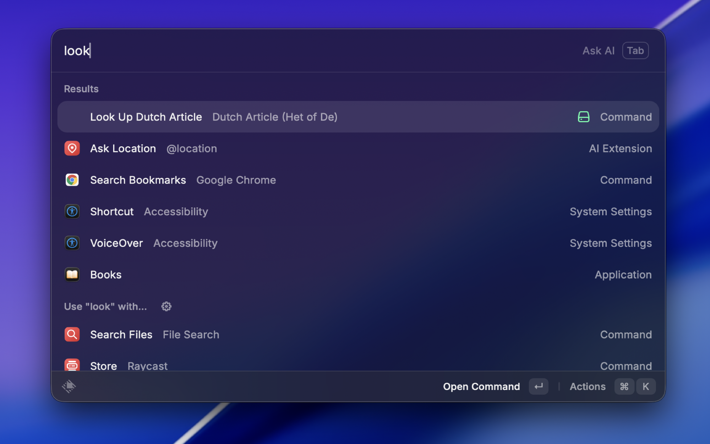
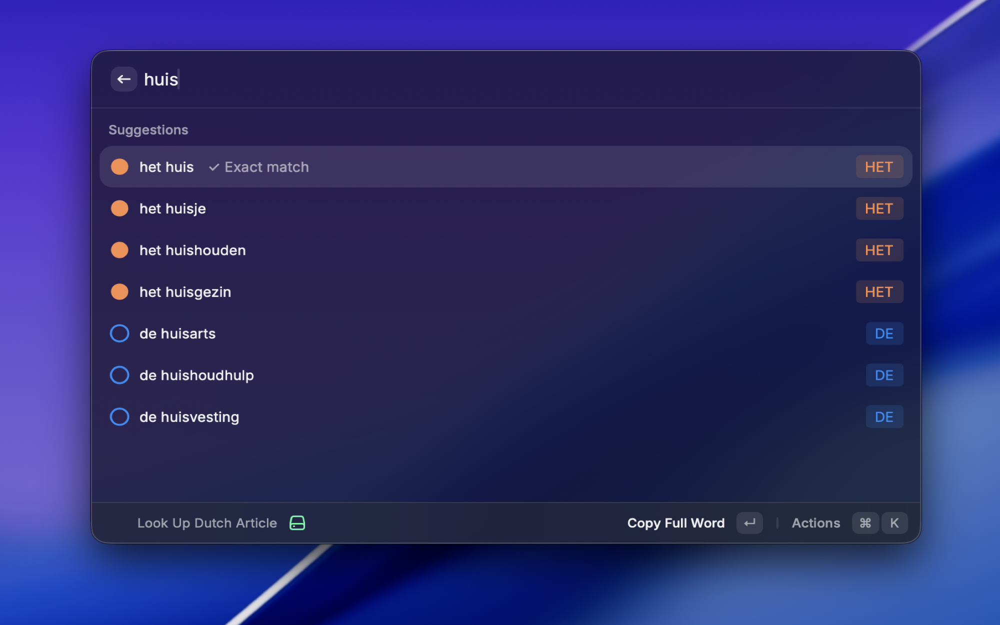
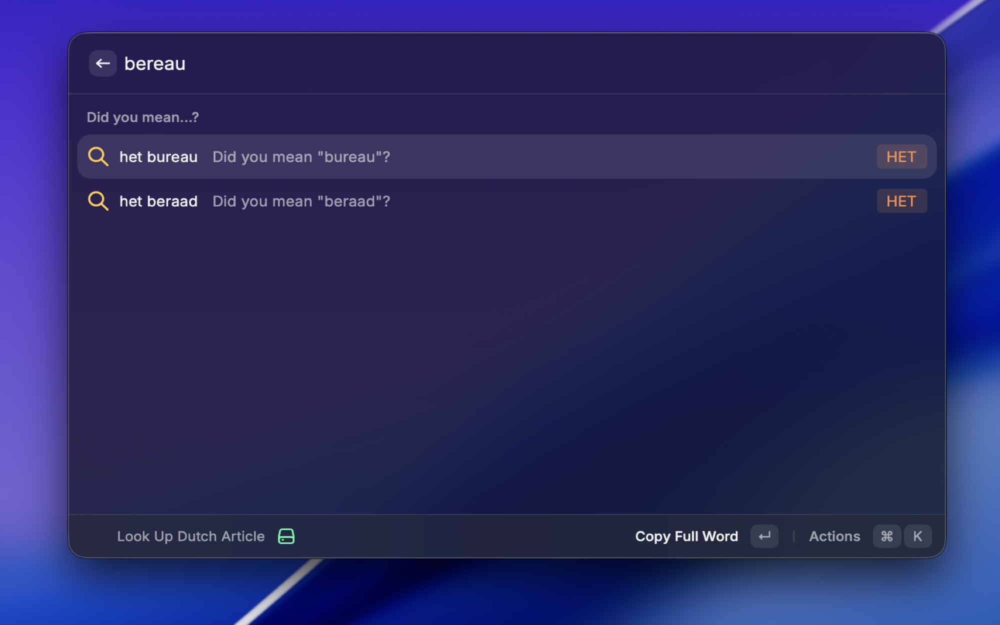
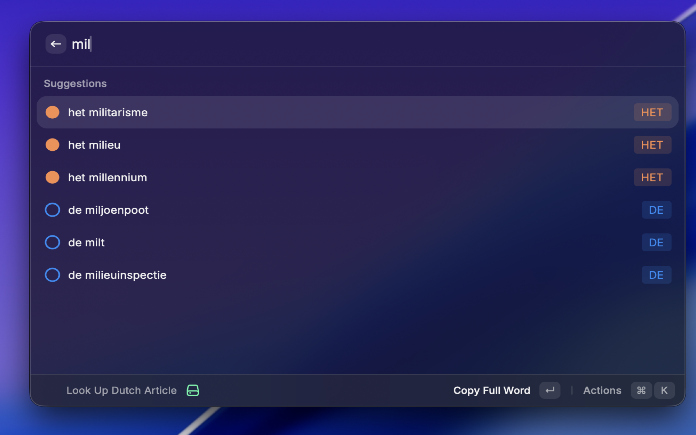

# Dutch Article (de / het)

A Raycast extension to quickly check whether a Dutch noun uses **de** or **het**.

## What it does
Type a Dutch word and instantly see which article it takes:
- **het huis**
- **de tafel**

Useful for Dutch learners who want a fast, distraction-free lookup without opening a browser.

## How to use
1. Open Raycast
2. Run **Look Up Dutch Article**
3. Enter a Dutch noun
4. Get **de** or **het** immediately

## Examples
- `huis` → **het**
- `boek` → **het**
- `tafel` → **de**
- `auto` → **de**

## Who is this for
- Dutch language learners (NT2, B1–C1)
- People writing Dutch professionally
- Anyone tired of guessing 😄

## Notes
- This extension focuses on common singular nouns.
- Some edge cases and loanwords may vary by usage.

## Screenshots

## License
MIT