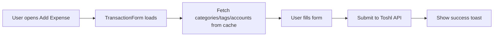
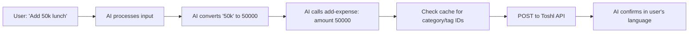
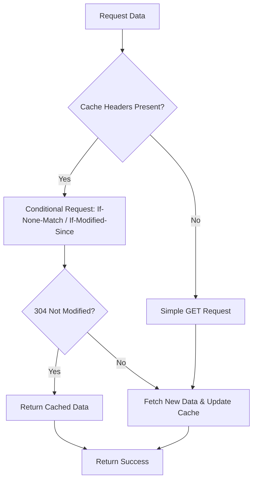

# Logic & Architecture

## 🏗️ Codebase Structure

```text
src/
├── components/
│   ├── TransactionForm.tsx   # Shared form for expense/income (create & edit)
│   └── TransferForm.tsx      # Transfer between accounts form
├── tools/                    # AI Chat tools
│   ├── add-expense.ts        # AI: Add expense
│   ├── add-income.ts         # AI: Add income  
│   ├── get-budgets.ts        # AI: Get budget status
│   ├── get-planning.ts       # AI: Get planning outlook
│   ├── list-categories-tags.ts # AI: List categories/tags/accounts
│   └── search-entries.ts     # AI: Search & filter entries
├── utils/
│   ├── toshl.ts              # ToshlClient API wrapper with caching
│   ├── types.ts              # TypeScript interfaces
│   └── helpers.ts            # Shared utilities (parseAmount, parseDate, symbols)
├── expense.tsx               # Add Expense command
├── income.tsx                # Add Income command
├── transfer.tsx              # Add Transfer command
├── recent-transactions.tsx   # Recent Transactions list
├── search-entries.tsx        # Advanced Search UI
├── planning.tsx              # View Planning command
└── budgets.tsx               # Budgets view
```

---

## 🔄 Application Flow

### Adding an Expense (Manual)



### Adding via AI Chat



### Caching Flow



---

## 🛠️ Tech Stack

| Technology | Purpose |
| ---------- | ------- |
| **TypeScript** | Type-safe development |
| **React** | Raycast UI components |
| **@raycast/api** | Raycast extension framework |
| **@raycast/utils** | useCachedPromise, usePromise hooks |
| **Axios** | HTTP client for Toshl API |
| **date-fns** | Date manipulation and formatting |

---

## 🚀 Development

```bash
# Install dependencies
npm install

# Development mode
npm run dev

# Build
npm run build

# Lint
npm run lint
```

---

## 📝 API Reference

This extension uses the [Toshl API v2](https://developer.toshl.com/docs/):

- `GET /entries` - List transactions
- `POST /entries` - Create transaction/transfer
- `PUT /entries/:id` - Update transaction
- `DELETE /entries/:id` - Delete transaction
- `GET /categories` - List categories
- `GET /tags` - List tags
- `GET /accounts` - List accounts
- `GET /budgets` - List budgets
- `GET /planning` - Get financial planning
- `GET /currencies` - List supported currencies
- `GET /me` - Get user profile and default settings
