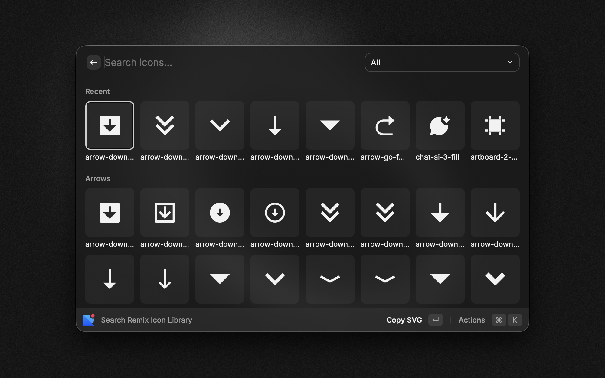

# Remix Icon



A Raycast extension to search and browse [Remix Icon](https://remixicon.com/) library (v4.8.0) with icons across 19 categories.

## Features

- **Search & Browse**: Instantly search through icons by name
- **Category Filtering**: Filter icons by 19 categories (Arrows, Buildings, Business, Communication, Design, Development, Device, Document, Editor, Finance, Food, Health & Medical, Logos, Map, Media, Others, System, User & Faces, Weather)
- **Recent Icons**: Quick access to your last 8 used icons
- **Multiple Export Formats**:
  - **SVG**: Raw SVG code for direct use
  - **React Component**: Ready-to-use component tags (e.g., `<RiHeartFill size={24} />`)
  - **Data URI**: Base64 encoded for inline use
  - **Webfont**: HTML tag (`<i class="ri-heart-fill"></i>`)
  - **CDN Link**: Versioned webfont CDN link
  - **NPM Install**: Command to install Remix Icon package
  - **React Import**: Import statement for React components
- **Quick Links**: Direct access to Remix Icon homepage and GitHub repository

## Installation

Install via the [Raycast Store](https://www.raycast.com/tristan_heinig/remix-icon) or build from source.

## Development

### Prerequisites

- Node.js 22.14+
- [Raycast](https://www.raycast.com/) installed on macOS

### Setup

```bash
# Install dependencies
npm install

# Start development mode
npm run dev

# Build for production
npm run build

# Lint code
npm run lint

# Fix linting issues
npm run fix-lint

# Update to latest Remix Icon release
npm run update-icons

# Validate React component names
npm run validate
```

### Updating Icons

To sync with the latest Remix Icon release from GitHub:

```bash
npm run update-icons
# or directly:
./scripts/update-icons.sh
```

The update script:

- **Version checking**: Automatically detects and downloads new releases
- **Official releases**: Downloads the `RemixIcon_Svg_*.zip` asset from GitHub releases
- **Smart updates**: Only updates when a new version is available (tracked in `assets/metadata.json`)
- **Auto-rebuild**: Regenerates `catalogue.json` from downloaded icons
- **Metadata generation**: Updates `metadata.json` with version info for CDN links

**Requirements**: `jq`, `curl`, `unzip` (pre-installed on macOS)

#### ⚠️ Important: Version Synchronization

When updating icons, ensure the RemixIcon version matches the `@remixicon/react` package version:

```bash
# After running update-icons, check the downloaded version
cat assets/metadata.json

# Update @remixicon/react to match (if version 4.8.0)
npm install -D @remixicon/react@4.8.0

# Validate React component names match the official package
npm run validate
```

This ensures the React component names exported by the extension match the official `@remixicon/react` package.

### Project Structure

```
src/
├── search.tsx              # Main command with Grid view and filtering
├── CategorySection.tsx     # Renders icon grid sections
├── IconActionPanel.tsx     # Action menu for copy operations
├── types.ts                # TypeScript interfaces
└── utils.ts                # Helper functions (Raycast environment)

assets/
├── catalogue.json          # Icon metadata
├── metadata.json           # Version info for CDN links
├── logo.png                # Extension icon
└── icons-compressed/       # Compressed JSON files (one per category)

scripts/
├── update-icons.sh         # Downloads latest release and rebuilds catalogue
├── validate-react-names.mjs # Validates React component name generation
└── utils.mjs               # Helper functions (Node.js environment)

metadata/
├── remix-icon-1.png        # Store screenshot 1
├── remix-icon-2.png        # Store screenshot 2
└── remix-icon-3.png        # Store screenshot 3
```

## Future Enhancements

- SVG sprite export
- PNG export support
- Starred/favorite icons
- Configurable preferences (default size, color, className)
- Vue component export

## License

MIT License - Extension code by [Tristan Heinig](https://github.com/tristan_heinig)

Icons by [Remix Design](https://github.com/Remix-Design/RemixIcon) (Apache License Version 2.0)
