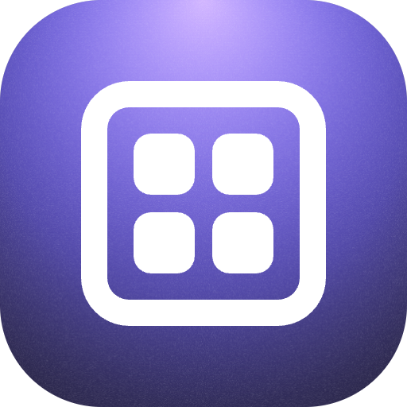

<div align="center">



# Respace - Workspace Manager for Raycast

A powerful Raycast extension to open apps, files, folders, URLs, and terminal commands in organized workspace bundles with a single click.

</div>

## ✨ Features

- 📦 **Workspace Bundles**: Group apps, folders, files, URLs, and terminal commands together
- 🚀 **One-Click Launch**: Open entire workspaces instantly
- ⚡ **Quick Open**: CLI-style launcher for instant access to workspace items
- ⏱️ **Launch Delays**: Configure delays between opening items
- 🔍 **Quick Search**: Find workspaces quickly with Raycast's search
- ✏️ **Full CRUD**: Create, edit, and delete workspaces easily
- 💾 **Local Storage**: Data stored in `~/.config/respace-raycast/`
- 🎨 **Beautiful UI**: Native Raycast UI with icons and error handling
- 🔗 **Deeplinks**: Share direct links to your workspaces

## 🧭 Commands

### 🗂️ Open Workspace

List and launch your workspaces. Simply search for a workspace and press Enter to open all its items.

### ⚡ Quick Open

CLI-style quick launcher for instant access to any item across all your workspaces. Type to search and press Enter to open individual items without launching the entire workspace.

### 🛠️ Manage Workspaces

Create, edit, and delete workspaces with a full management interface.

## 📦 Installation

1. Clone this repository
2. Install dependencies: `npm install`
3. Build the extension: `npm run build`
4. Import into Raycast

## 🎮 Usage

### 🆕 Creating a Workspace

1. Open "Manage Workspaces" command
2. Press `Cmd+N` to create a new workspace
3. Add items:
   - **Apps**: e.g., "Google Chrome", "Slack"
   - **Folders**: e.g., "/Users/username/Projects"
   - **Files**: e.g., "/Users/username/Documents/notes.md"
   - **URLs**: e.g., "https://github.com"
   - **Terminal**: e.g., "cd ~/project && npm start"
4. Set optional launch delays for each item
5. Save your workspace

### ▶️ Launching a Workspace

1. Open "Open Workspace" command
2. Search for your workspace
3. Press Enter to launch all items

### 🎯 Quick Opening Individual Items

1. Open "Quick Open" command
2. Type to search across all workspace items
3. Press Enter to open just that item (without launching the entire workspace)

## 🧪 Example Workspace

**Web Development Environment**

- VS Code (app)
- Chrome (app)
- GitHub (URL) - 1s delay
- Project folder (folder) - 2s delay
- Terminal: `cd ~/project && npm start` - 3s delay

## 🧑‍💻 Development

```bash
# Install dependencies
npm install

# Run in development mode
npm run dev

# Build for production
npm run build

# Lint code
npm run lint

# Fix lint issues
npm run fix-lint
```

## 🧰 Technology Stack

- **TypeScript**: Type-safe development
- **Raycast API**: Native Raycast integration
- **Prettier**: Code formatter
- **ESLint**: Code linter

## 💾 Storage

Workspaces are stored as JSON in `~/.config/respace-raycast/workspaces.json`

## 📄 License

MIT

## 🤝 Contributing

Contributions are welcome! Please open an issue or submit a pull request.
