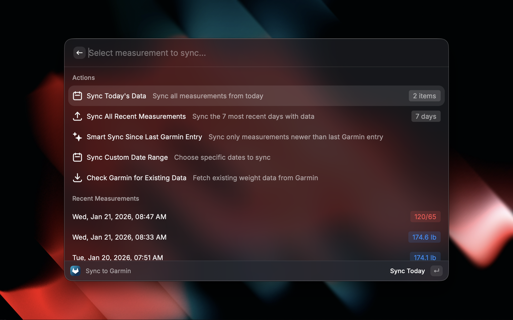

# Withings Sync for Raycast

Sync your Withings health data (weight, blood pressure, body composition) to Garmin Connect directly from Raycast.

## Screenshots




## Features

- 📊 **View Measurements**: View your recent Withings measurements including weight (lb or kg), body fat, blood pressure, and heart rate
- ⬆️ **Sync to Garmin**: Upload your Withings data to Garmin Connect with one click
- 📅 **Sync Today's Data**: Quick action to sync all measurements from today
- 🏋️ **Complete Body Composition**: Syncs weight, body fat, body water, bone mass, and skeletal muscle mass
- 🔐 **Secure Authentication**: OAuth-based authentication with automatic token refresh for Withings, session-based auth for Garmin
- 🩺 **Blood Pressure Support**: Optionally include blood pressure readings in your sync
- ⚡ **Fast & Lightweight**: Built with TypeScript and React for optimal performance

## Installation

### For End Users

Install directly from the [Raycast Store](https://raycast.com/store) by searching for "Withings Sync"

### For Developers

If you want to build or modify this extension locally:

```bash
npm install
npm run dev     # Development mode with hot reload
npm run build   # Build for distribution
```

## Setup

### 1. Register Withings OAuth App

**REQUIRED**: You must register your own Withings OAuth application:

1. Go to https://developer.withings.com/ and create an account
2. Create a new OAuth 2.0 application
3. Set the **Redirect URI** to: `https://raycast.com/redirect?packageName=Extension`
4. Copy your Client ID and Client Secret

### 2. Configure in Raycast Preferences

1. Open Raycast and press `⌘ + ,` (Command + Comma)
2. Find "Withings Sync" in the extensions list
3. Configure your credentials:
   - **Withings Client ID**: Your OAuth Client ID from step 1
   - **Withings Client Secret**: Your OAuth Client Secret from step 1
   - **Garmin Username**: Your Garmin Connect email
   - **Garmin Password**: Your Garmin Connect password
   - **Weight Unit**: Choose pounds (lb) or kilograms (kg) - defaults to pounds
   - **Include Blood Pressure**: Enable/disable blood pressure sync
   - **Default Lookback Days**: Number of days to fetch measurements for (default: 7)

### 3. Authorize Withings

1. Open Raycast and search for "Configure Withings & Garmin"
2. Click "Authorize Withings"
3. Sign in to your Withings account in the browser
4. Grant permissions to Raycast

## Commands

### View Withings Measurements

Browse your recent health measurements from Withings including:

- Weight (configurable: lb or kg)
- Body fat percentage
- Blood pressure (systolic/diastolic)
- Heart rate
- Bone mass
- Skeletal muscle mass

### Sync to Garmin

Upload your Withings measurements to Garmin Connect with multiple sync options:

- **Sync Today's Data**: Upload all measurements from today in one action
- **Sync All Recent**: Batch sync the most recent days with data
- **Smart Sync Since Last Garmin Entry**: Automatically sync only measurements newer than your last Garmin entry (⌘S)
- **Custom Date Range Sync**: Choose specific start and end dates to sync (up to 90 days)
- **Check Garmin for Existing Data**: View what's already in Garmin and sync only new measurements (⌘N)
- **Individual Sync**: Sync specific measurements one at a time
- **Sync Forward**: Select any measurement and sync it plus all newer ones (⌥Enter)
- Includes weight, body fat, body water, bone mass, muscle mass, and optionally blood pressure

### Configure Withings & Garmin

Manage your account connections and view configuration status.

## Preferences

All credentials are configured in Raycast preferences (`⌘ + ,`):

- **Withings Client ID**: Your Withings OAuth Client ID from https://developer.withings.com/
- **Withings Client Secret**: Your Withings OAuth Client Secret
- **Garmin Username**: Your Garmin Connect email address
- **Garmin Password**: Your Garmin Connect password
- **Weight Unit**: Display weight in pounds (lb) or kilograms (kg) - defaults to pounds
- **Include Blood Pressure**: Whether to sync blood pressure measurements
- **Default Lookback Days**: Number of days to fetch measurements for (default: 7)

## Privacy & Security

- All credentials are stored securely in Raycast's encrypted storage
- OAuth tokens are automatically refreshed
- No data is sent to third parties
- Garmin password is stored locally and never transmitted except to Garmin

## Troubleshooting

### "Not authenticated" error

Run the "Configure Withings & Garmin" command and click "Authorize Withings"

### Garmin sync fails

1. Verify your Garmin credentials in preferences
2. Check that you can log in to connect.garmin.com
3. Try disconnecting and reconnecting in the configure command

### No measurements showing

- Ensure you have recent measurements in your Withings account
- The extension shows measurements from the last 7 days by default (configurable in preferences)

## Contributing

Contributions are welcome! Feel free to:

- Report bugs or request features via [GitHub Issues](https://github.com/thebruge/withings-raycast/issues)
- Submit pull requests for improvements
- Share feedback on the extension

## Credits

Based on [withings-sync](https://github.com/jaroslawhartman/withings-sync) by Jaroslaw Hartman.

## License

MIT License
