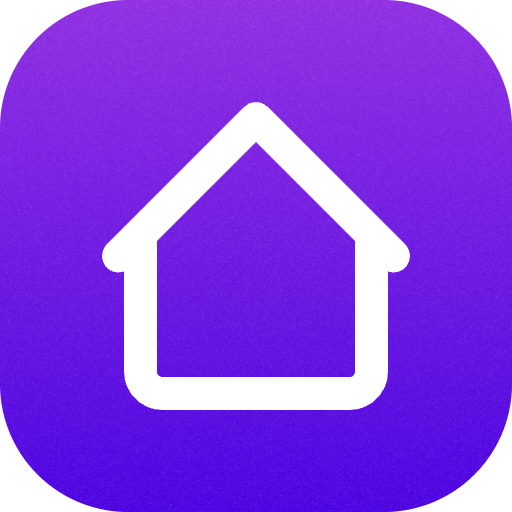

<div align="center">

# Yandex Smart Home — Raycast Extension



Control Yandex Smart Home devices and run scenarios from Raycast.

[](https://www.raycast.com/devall/yandex-smart-home)
[](https://github.com/raycast/extensions/blob/master/LICENSE)

[](https://twitter.com/intent/follow?screen_name=netebe)

</div>

## Commands

- **Devices** — List all smart home devices; turn on/off, set brightness where supported.
- **Scenarios** — List active scenarios and run them.

## Setup

### 1. Create a Yandex OAuth app

1. Open [Yandex OAuth](https://oauth.yandex.ru/) and sign in.
2. Create a new application (or use an existing one).
3. **Platform**: choose **Для доступа к API или отладки**.
4. **Permissions**: enable **iot:view** and **iot:control** (Smart Home).
5. **Callback URL**: set exactly  
   `https://oauth.yandex.ru/verification_code`  
   (Yandex will show a 7-digit code on this page instead of redirecting.)

6. Save and copy the **Client ID**.

### 2. Configure the extension

1. In Raycast: **Extensions** → **Yandex Smart Home** → **Preferences** (gear icon).
2. Paste your **Yandex OAuth Client ID** into **Yandex OAuth Client ID**.
3. Leave **Callback URL** as `https://oauth.yandex.ru/verification_code` unless your Yandex app uses another.

### 3. Connect

1. Run **Devices** or **Scenarios**.
2. If you’re not connected, you’ll see a form:
   - Click **Open Yandex** — the browser opens; log in and allow access.
   - On the Yandex page you’ll see a **7-digit code**. Copy it.
   - Paste the code into the form and press **Connect**.
3. After that, devices and scenarios will load; you can turn devices on/off and run scenarios.

## Development

```bash
npm install
npm run dev
```

Then run the extension from Raycast. Use **Debug Logs** in preferences to see API and auth details in the Raycast development console.

## API

The extension uses the [Yandex Smart Home API for user applications](https://yandex.ru/dev/dialogs/smart-home/doc/ru/concepts/platform-protocol):

- Host: `https://api.iot.yandex.net`
- Auth: OAuth 2.0 Bearer token (PKCE, verification code flow)
- Scopes: `iot:view`, `iot:control`

## License

MIT
